<p align="center">
  <picture>
    <source media="(prefers-color-scheme: dark)" srcset="docs/logo-dark.png">
    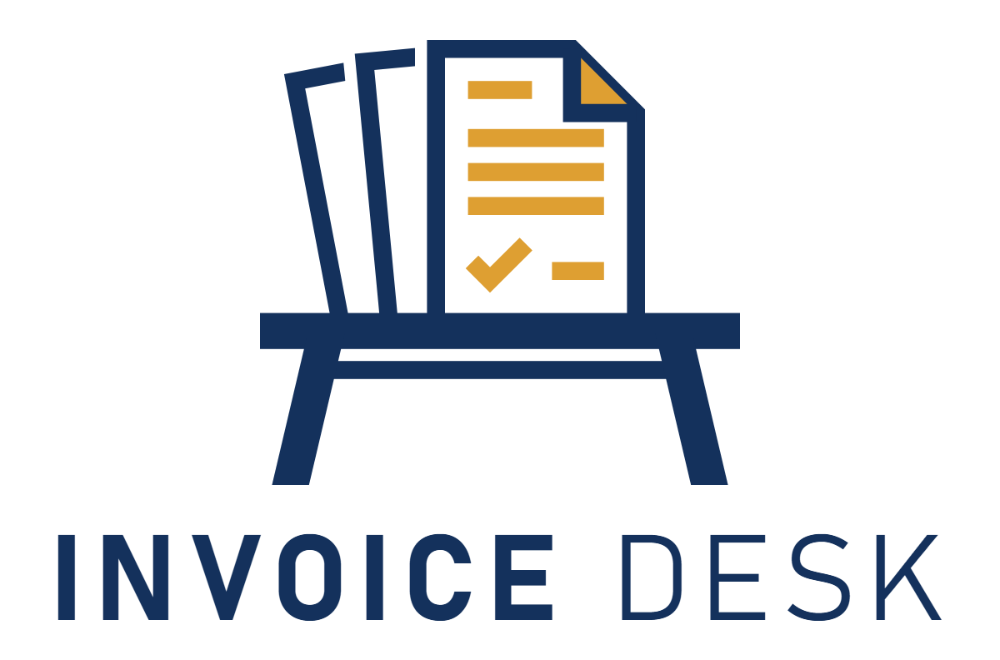
  </picture>
</p>

# InvoiceDesk

A Windows desktop app for sending invoices to clients and keeping track of
money in and out. Made for sole traders and small businesses in Australia,
New Zealand, the UK, Canada and the US, so it follows your country's GST, VAT
or sales tax rules. It runs as one exe and keeps your data on your own PC.

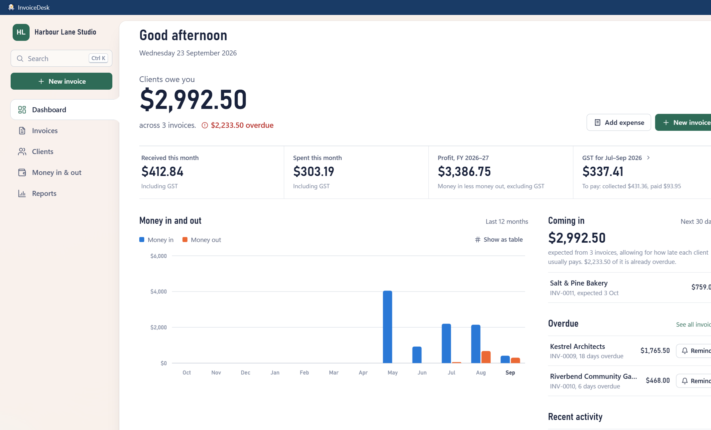

## Download

**[Download InvoiceDesk.exe](https://github.com/tdh1985/invoicedesk/releases/latest/download/InvoiceDesk.exe)**
for Windows 10 and 11 (64-bit), or see [all releases](https://github.com/tdh1985/invoicedesk/releases).

It's a single file with nothing to install. The exe isn't code-signed yet, so
Windows SmartScreen may say it protected your PC. Click **More info**, then
**Run anyway**.

## Features

- Invoices with tax turned on or off per invoice, and a heading that matches
  your country, like **TAX INVOICE** or **VAT INVOICE**. Lines that carry no
  tax are marked.
- A live preview next to the editor, on A4 or US Letter to match your country.
  Exported PDFs match the preview.
- Drafts save as you type. Invoices go from draft to sent, then part-paid,
  paid or overdue. You can void a sent invoice but not delete it.
- Email an invoice in one click. With classic Outlook the PDF is attached for
  you. With other mail apps the email opens and the PDF's folder opens beside
  it, ready to drag in.
- Chase overdue invoices with a friendly, firm or final reminder you can edit
  before it goes. Each one is kept in the invoice's history.
- Make an invoice repeat weekly, fortnightly, monthly, quarterly or yearly.
  Each one is drafted when it comes round, ready for you to check and send.
- Send quotes with their own numbering and a valid-until date. Mark them
  accepted or declined, and turn one into an invoice in one click. Quotes never
  count toward what you're owed.
- Send a client a statement of everything they owe, with the balances aged
  into 30-day columns.
- Record payments against invoices, plus other income and expenses, with
  receipts attached (PDF, JPG, PNG or WebP, up to 25 MB each).
- Drop a receipt photo or PDF onto the Money page and it fills in the amount,
  tax, date and supplier for you. It uses the text reader built into Windows,
  so nothing leaves your PC, and it only fills fields you haven't typed in.
- Dashboard with outstanding and overdue totals, money in and out, profit for
  the tax year, tax for the current return period and a 12-month chart.
- Reports with your country's tax return worksheet and a profit and loss for
  any period or tax year, saved as PDF or CSV.
- Your business details, logo (JPG, PNG or WebP up to 5 MB), bank details,
  accent colour, invoice numbering and payment terms, and a choice of three
  invoice layouts: classic, modern and minimal.
- Clients with their own notes, website and a note printed on every invoice.
- Each client shows how late they usually pay, and the dashboard shows what's
  likely to come in over the next 30 days based on those habits.
- It learns from what you've already entered. Line items suggest what you last
  charged that client, and an expense picks the category you used last time
  for the same supplier.
- Export invoices, or money in and out, as a CSV file for your accountant or
  Excel.
- Search everything with Ctrl+K, which also runs commands like recording a
  payment or switching theme. Ctrl+N starts a new invoice, Ctrl+S saves, and
  ? lists every shortcut.
- Light and dark themes. On Windows 11 the window edges pick up your desktop
  colours, which you can turn off in Settings.
- Right-click the taskbar icon to start a new invoice or add an expense or
  income. The icon shows how many invoices are overdue.
- Your data can live in a OneDrive, Dropbox or Google Drive folder so you can
  use it on another PC, one PC at a time.

## Countries

Pick your country in **Settings → Business**. It sets your tax, currency, tax
number, bank details, tax year and tax return.

| Country | Tax | Tax number | Bank details | Tax year starts | Report |
|---|---|---|---|---|---|
| Australia | GST 10% | ABN | BSB and account | 1 July | BAS worksheet (G1, 1A and 1B) |
| New Zealand | GST 15% | GST number | Bank account | 1 April | GST return (boxes 5 to 15) |
| United Kingdom | VAT at 20%, 5%, 0% or exempt | VAT number | Sort code and account | 6 April | VAT return (boxes 1 to 9) |
| Canada | GST or HST at your client's province's rate | GST/HST number | Transit, institution and account | 1 January | GST/HST return |
| United States | Sales tax at your rate | EIN | Routing and account | 1 January | Sales tax summary |

- Tax numbers are checked as you type, so a mistyped digit is caught before it
  reaches an invoice.
- Clients can be anywhere. An invoice to a client overseas starts with no tax
  and a note you can edit, and shows their country.
- Bill a client in their own currency: AUD, NZD, GBP, CAD, USD, EUR, SGD, HKD,
  CHF, SEK, NOK, DKK or ZAR. When they pay, you enter what they paid and what
  reached your bank, and your reports use what reached your bank. There's no
  exchange rate lookup, so nothing goes online.
- Choose how often you send your return, like every two months in New Zealand
  or your VAT quarter in the UK.
- Your country locks once you've sent an invoice or recorded money, so past
  amounts never change currency. For a business in another country, start a
  new data folder in **Settings → Your data**.
- Quebec QST and the provincial sales taxes in BC, Saskatchewan and Manitoba
  aren't covered yet.

## Screenshots

The business and clients in these are made up.

**Writing an invoice, with the live preview beside it**

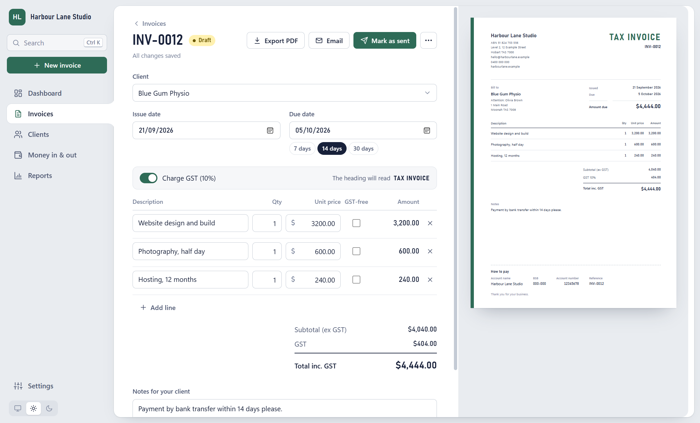

**Invoices, with drafts, overdue and repeating ones picked out**

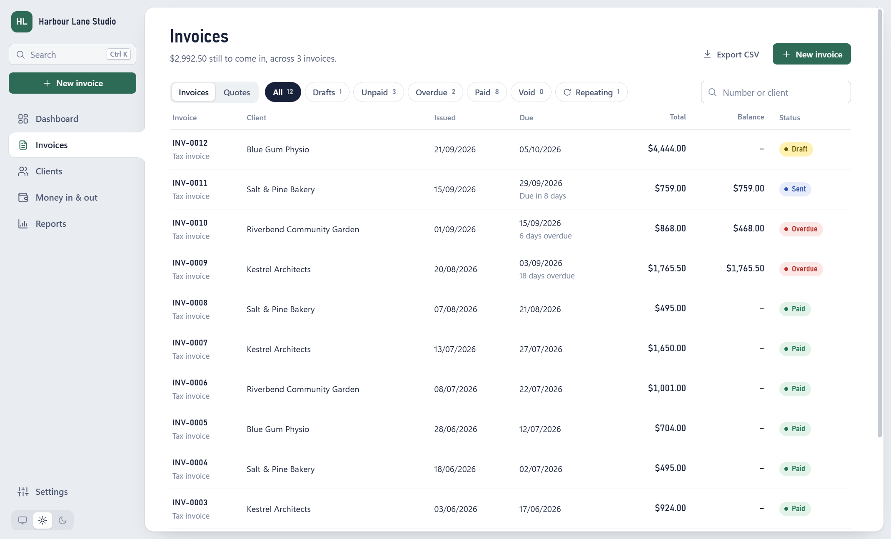

**Quotes, and whether each client said yes**

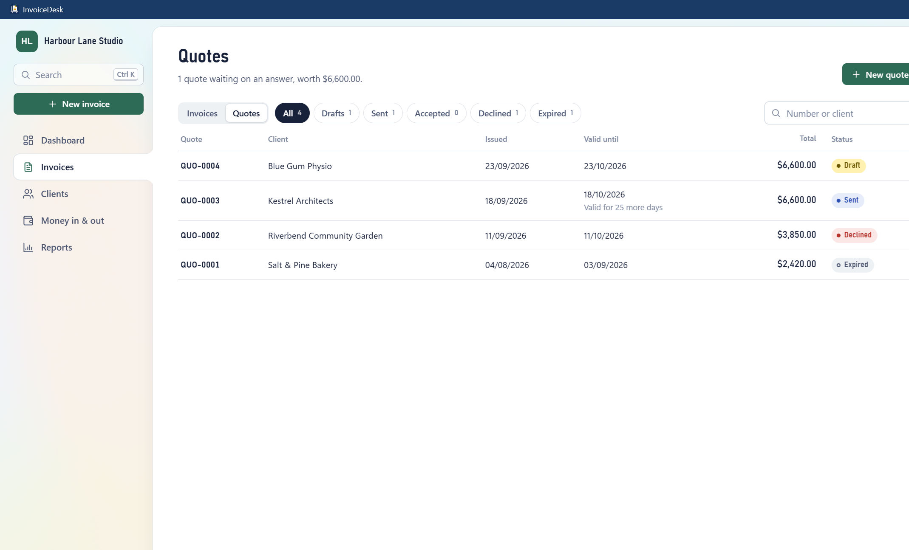

**A sent quote, one click from becoming an invoice**

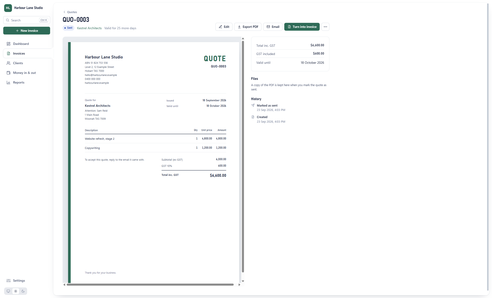

**Drop a receipt and the details fill themselves in**

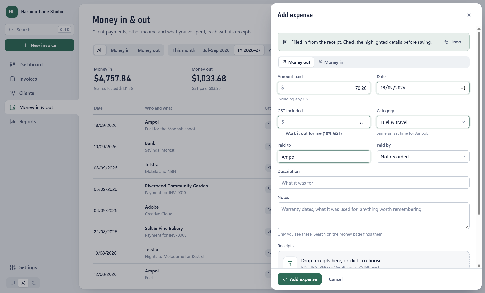

**A BAS worksheet for the quarter, ready for your accountant**

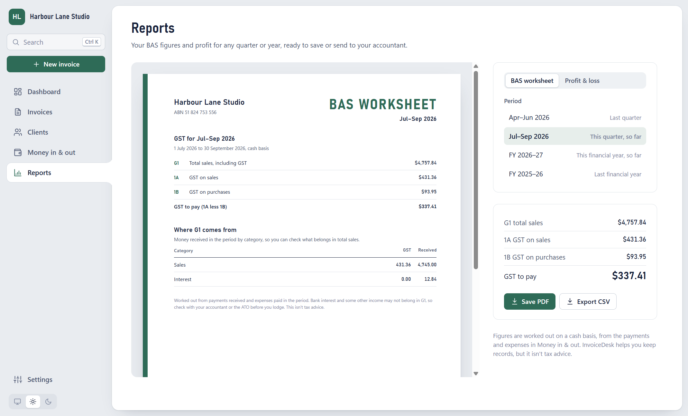

**Each client's payment habits, invoices and quotes**

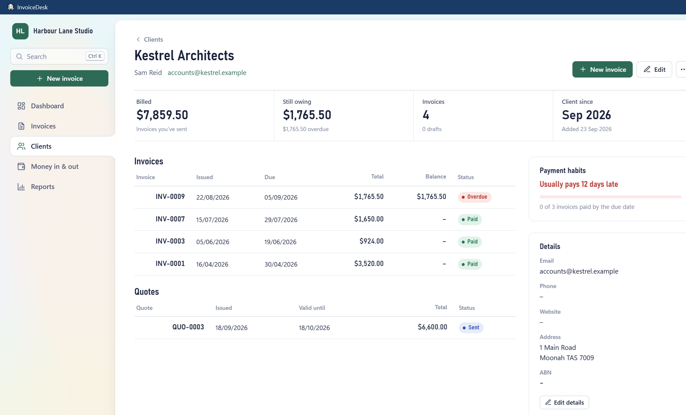

**Three invoice layouts: classic, modern and minimal**

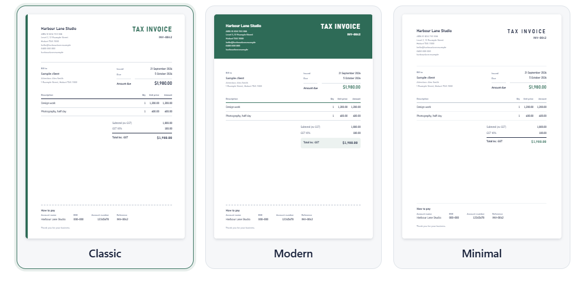

**Money in and out for the financial year**

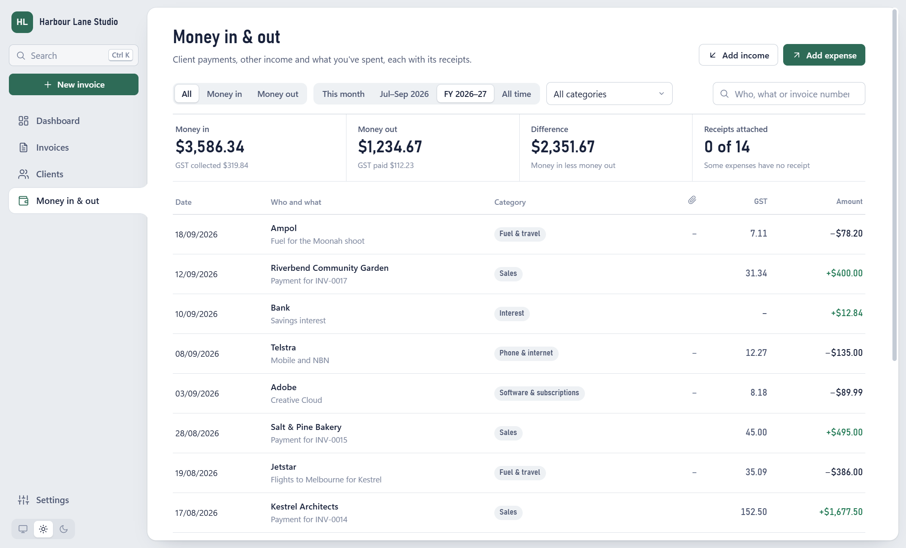

**Dark theme**

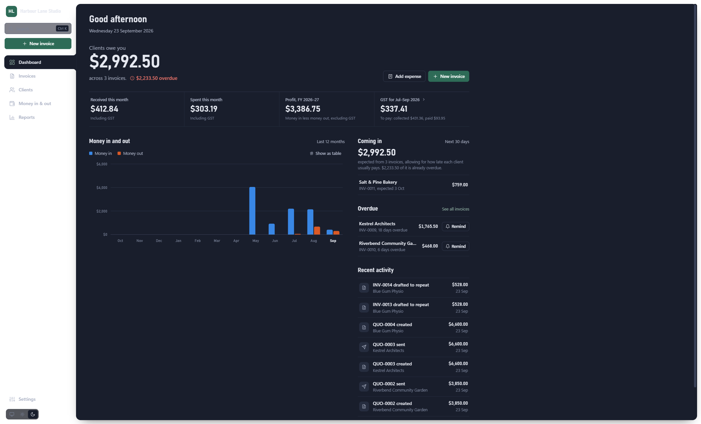

## Requirements

- Windows 10 (1809) or later, 64-bit
- [Microsoft Edge WebView2 Runtime](https://developer.microsoft.com/microsoft-edge/webview2/),
  which Windows 11 already has
- [.NET 10 SDK](https://dotnet.microsoft.com/download), only if you're building it yourself

## Build and run

```powershell
dotnet run --project src/InvoiceDesk.App
```

Build the single exe (self-contained, so it doesn't need .NET installed). It
ends up in `dist\InvoiceDesk.exe`:

```powershell
dotnet publish src/InvoiceDesk.App -p:PublishProfile=SingleExe
```

## Where your data lives

Everything is in `%LOCALAPPDATA%\InvoiceDesk\` unless you move it in
**Settings → Your data**:

| Path | What it is |
|---|---|
| `invoicedesk.db` | SQLite database |
| `attachments\` | copies of receipts and logos (your originals aren't moved) |
| `exports\` | exported PDFs |
| `backups\` | a copy of the database from each start, the last 10 kept |

The app makes a backup each time it starts. You can also copy the whole folder
yourself to take your own backup.

InvoiceDesk never goes online by itself. **Settings → About** has a **Check
for updates** button, which asks GitHub for the latest version only when you
click it.

## How the code is laid out

| Project | What's in it |
|---|---|
| `src/InvoiceDesk.Core` | Data model, tax rules for each country, money maths, numbering, EF Core with SQLite, services and file storage. No UI code. |
| `src/InvoiceDesk.App` | The WPF window hosting Blazor (`BlazorWebView`), Razor pages and components, CSS and PDF export. |

Money is stored as whole cents (`long`) and tax rates as parts per million
(10% = 100,000), so rates like 8.875% fit. Totals are rounded half away from
zero, and tax is worked out once per rate on each invoice rather than per line.
Each country's rules live in one file under `InvoiceDesk.Core/Rules/Countries`.

To change the database schema, edit the entities in `InvoiceDesk.Core/Domain`
and add a migration:

```powershell
dotnet tool restore
dotnet ef migrations add <Name> --project src/InvoiceDesk.Core
```

Migrations are applied automatically on startup.

## Disclaimer

InvoiceDesk helps you keep records. It isn't tax advice, so check your figures
with your accountant or your tax office: the ATO, IRD, HMRC, CRA, or the IRS
and your state.

## License

[MIT](LICENSE) © 2026 Tim Downey

## Support

If InvoiceDesk saves you time, feel free to buy me a coffee, or more, through
PayPal at [paypal.me/timdowney](https://paypal.me/timdowney).
